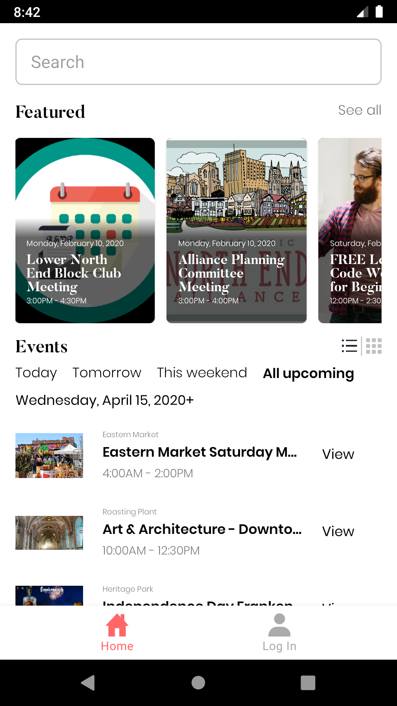
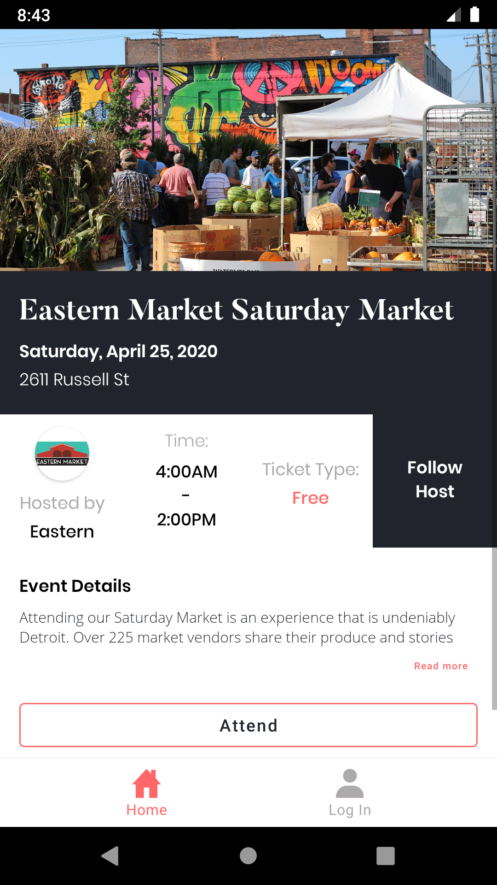
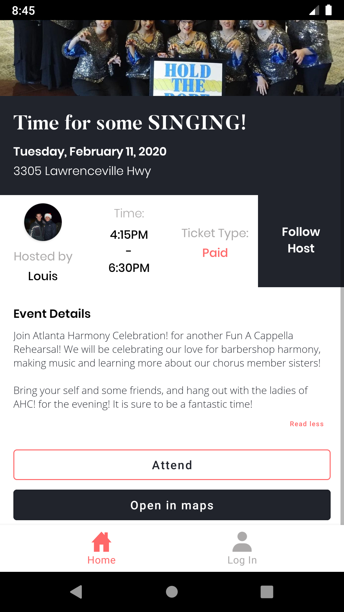
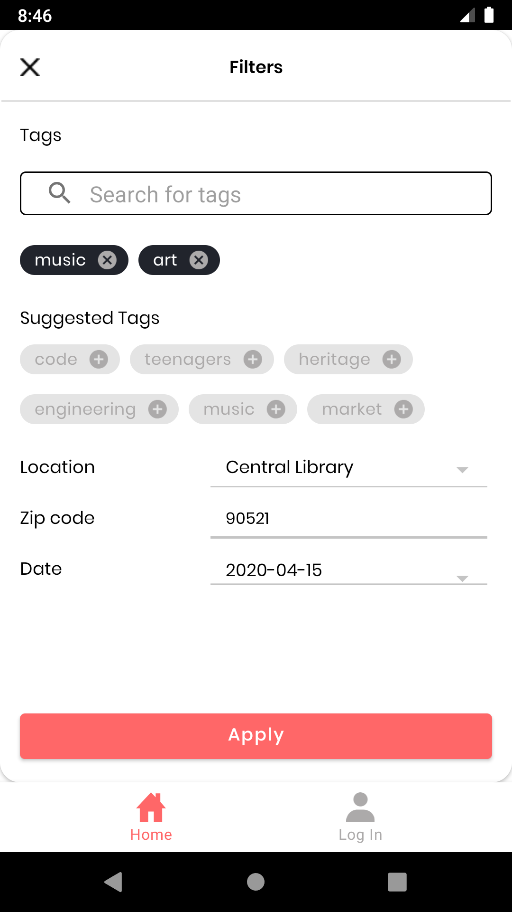
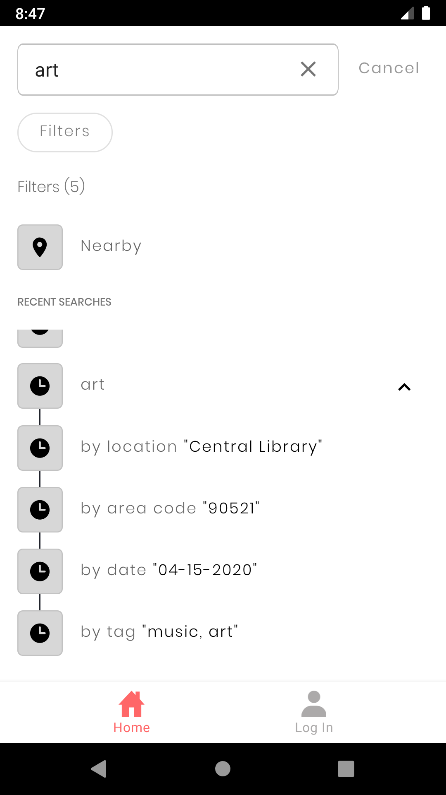
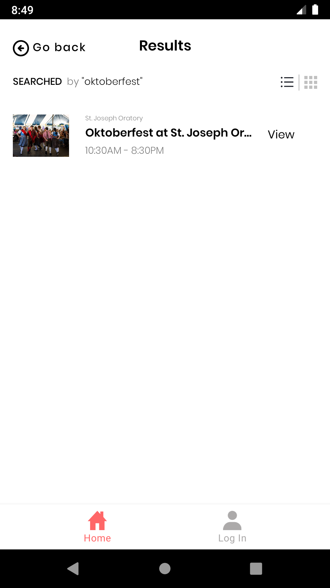

# Community Calendar

You can find the deployed project in the [Google Play Store](https://play.google.com/store/apps/details?id=com.lambda_school.community_calendar). Code for other teams: [Web frontend](https://github.com/Lambda-School-Labs/community-calendar-fe), [Backend](https://github.com/Lambda-School-Labs/community-calendar-be), and [iOS](https://github.com/Lambda-School-Labs/community-calendar-ios)

## 3️⃣ Contributors

|                                       [Tyler Berrett](https://github.com/TylerBerrett)                                        |                                       [Justin Gent](https://github.com/justinbgent)                                        |                                       [Basil Havens](https://github.com/heiligbasil)                                        |
| :-----------------------------------------------------------------------------------------------------------: | :-----------------------------------------------------------------------------------------------------------: | :-----------------------------------------------------------------------------------------------------------: |
|                                             |                                             |                                             |
|                                  |                         |                       |
|  |  |  |
  

   [![License][license-image]][license-url] 

## Project Overview

[Vision Doc](https://www.notion.so/Vision-Problem-Objectives-46b01d5cdbfe428397ca4e1ddb7c4086)

[Deployed Project](https://play.google.com/store/apps/details?id=com.lambda_school.community_calendar)

[Trello Board](https://trello.com/b/itLFz188/labs19-community-calendar)

[Product Canvas](https://www.notion.so/06de41bdd6124a459140e0b943b648a1?v=a0986751fe6e4fcdaa6782c5f827871d)

[Wireframe](https://www.figma.com/file/rMUTr0Y5UBkm7AhAVCMrfW/Community-Calendar%2C-Nora-Barazanchi%2C-Jan-Patrick-Eliares?node-id=122%3A2)

Community Calendar is a project aimed to enable communities to better inform the community of upcoming events and the community to more easily access information about upcoming events in the community. The Android version is more particularly aimed to provide an interface individuals can use to see upcoming community events.

For those coming to work on this project, you will need the environment variables you can get [here](http://auth0.com/) when you login with the project account.

### Features

-    Display Event Lists
-    Search, Sort, and Filter Events

### Auth0

[Auth0](https://auth0.com/docs/libraries/auth0-android) is an authentication API that enables users to connect to the app with existing Google and Facebook accounts.

### Payment API

TBD

### Apollo-Android

[Apollo-Android](https://github.com/apollographql/apollo-android) is a GraphQL compliant client that generates Java and Kotlin models from standard GraphQL queries.

### Room Persistence Library

[Room](https://developer.android.com/topic/libraries/architecture/room) is a data persistence library that uses SQLite locally to store data.

### Koin

[Koin](https://insert-koin.io/) is a library for dependency injection.

## Requirements

-   Android Studio 3.5 and above
-   Android 5.0 (API level 21) and above

## Contributing

When contributing to this repository, please first discuss the change you wish to make via issue, email, or any other method with the owners of this repository before making a change.

Please note we have a [code of conduct](./CODE_OF_CONDUCT.md). Please follow it in all your interactions with the project.

### Issue/Bug Request

    ## Contributing

When contributing to this repository, please first discuss the change you wish to make via issue, email, or any other method with the owners of this repository before making a change.

Please note we have a [code of conduct](./code_of_conduct.md). Please follow it in all your interactions with the project.

### Issue/Bug Request

 **If you are having an issue with the existing project code, please submit a bug report under the following guidelines:**
 - Check first to see if your issue has already been reported.
 - Check to see if the issue has recently been fixed by attempting to reproduce the issue using the latest master branch in the repository.
 - Create a live example of the problem.
 - Submit a detailed bug report including your environment & browser, steps to reproduce the issue, actual and expected outcomes,  where you believe the issue is originating from, and any potential solutions you have considered.

### Feature Requests

We would love to hear from you about new features which would improve this app and further the aims of our project. Please provide as much detail and information as possible to show us why you think your new feature should be implemented.

### Pull Requests

If you have developed a patch, bug fix, or new feature that would improve this app, please submit a pull request. It is best to communicate your ideas with the developers first before investing a great deal of time into a pull request to ensure that it will mesh smoothly with the project.

Remember that this project is licensed under the MIT license, and by submitting a pull request, you agree that your work will be, too.

#### Pull Request Guidelines

- Ensure any install or build dependencies are removed before the end of the layer when doing a build.
- Update the README.md with details of changes to the interface, including new plist variables, exposed ports, useful file locations and container parameters.
- Ensure that your code conforms to our existing code conventions and test coverage.
- Include the relevant issue number, if applicable.
- You may merge the Pull Request in once you have the sign-off of two other developers, or if you do not have permission to do that, you may request the second reviewer to merge it for you.

### Attribution

These contribution guidelines have been adapted from [this good-Contributing.md-template](https://gist.github.com/PurpleBooth/b24679402957c63ec426).

### Screenshots

&nbsp;&nbsp;&nbsp;&nbsp;&nbsp;&nbsp;&nbsp;&nbsp;&nbsp;&nbsp;&nbsp;&nbsp;&nbsp;&nbsp;&nbsp;&nbsp;&nbsp;&nbsp;&nbsp;&nbsp;&nbsp;&nbsp;&nbsp;&nbsp;

## Documentation

See [Backend Documentation](https://github.com/Lambda-School-Labs/community-calendar-be) for details on the backend of our project.

[license-image]: https://img.shields.io/badge/License-MIT-blue.svg
[license-url]: LICENSE
