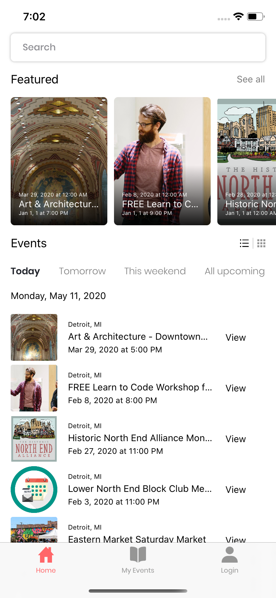
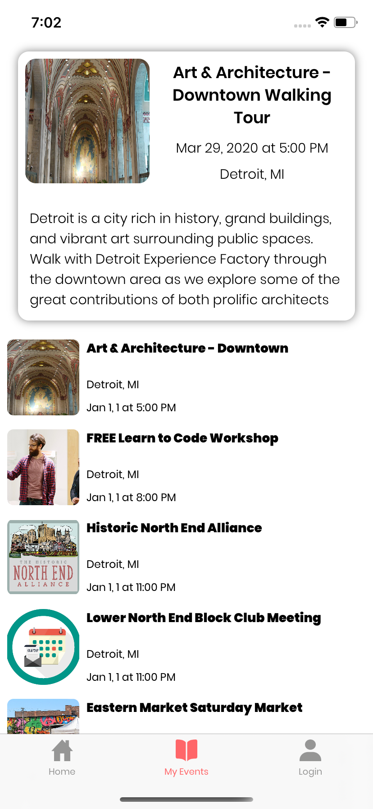
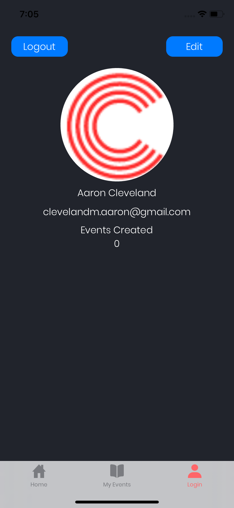

# Community Calendar  

[![Swift Version][swift-image]][swift-url]

[![License][license-image]][license-url]

  

There is a disconnect between event organizers and community members. From the perspective of organizers, it can be difficult to get the word out about an event to each of the members of a community. From the perspective of community members, it can be challenging to find out about all the events going on in your neighborhood. Community Calendar was created to bridge that gap. Now anyone with a mobile phone can be alerted of events going on in their area.

  

## Contributors

  

|[Hayden Hastings](https://github.com/hayden32)|[Jordan Christensen](https://github.com/mazjap)|[Michael McGrath](https://github.com/maybemichael)|[Aaron Cleveland](https://github.com/amclv)|[Austin Potts](https://github.com/AustinPotts)|

| :---: | :---: | :---: | :---: | :---: | :---: |

||||||

||||||

|  | |||||

  

## Project Overview

  

Developers, check out the wiki [here](https://github.com/Lambda-School-Labs/community-calendar-ios/wiki) for more in depth information on this project.

  

You can find the deployed project on [Test flight](https://testflight.apple.com/join/rrBz0v5r) (click link on mobile to install).

  

[Trello Board](https://trello.com/b/itLFz188/labs19-community-calendar)

  

[Product Canvas](https://www.notion.so/06de41bdd6124a459140e0b943b648a1?v=a0986751fe6e4fcdaa6782c5f827871d)

  

[UX Design files](https://www.figma.com/file/rMUTr0Y5UBkm7AhAVCMrfW/Community-Calendar%2C-Nora-Barazanchi%2C-Jan-Patrick-Eliares?node-id=380%3A303)

  

The app is divided into three different tabs: home, where you can find events tailored for you and search for specific events by name, distance, interest, category, and more; events, where you will see your RSVP'd events along with a full list of events in your area; and profile, where you are able to log in or sign up, view your favorited events, set a profile picture, and edit your information like name, email, etc.

  

    

  

### Features

  

- Okta authentication

- Open in maps

- Add event to calendar

- Search events by search term

- Sort events on home page

- Filter events by date, location, tag, etc.

- Table view to list events

- Collection view to list events

- Featured section to list events

- Apollo graphql implementation

- Real data and images pulled from backend

- UX's UI design

- Unit tests

  

### Okta

  

[Okta](https://okta.com/) connects any person with any application on any device. It's an enterprise-grade, identity management service, built for the cloud.

  

### Apollo

  

We integrated Apollo to query our [GraphQL backend](https://ccapollo-production.herokuapp.com/graphql). See [GetEventsQuery.graphql](Community%20Calendar/Community%20Calendar/GetEventsQuery.graphql) to view the query made.

  

### Cloudinary

  

[Cloudinary](https://cloudinary.com/) is an end-to-end imange and video management covering from uploads, storages manipulations and optimizations to delivery.

  

## Requirements

  

- iOS 13.0+

- Xcode 11

- Cocoapods

- Swift Package Manager

  

## Contributing

  

When contributing to this repository, please first discuss the change you wish to make via issue, email, or any other method with the owners of this repository before making a change.

  

Please note we have a [code of conduct](./CODE_OF_CONDUCT.md). Please follow it in all your interactions with the project.

  

### Issue/Bug Request

  

****If you are having an issue with the existing project code, please submit a bug report under the following guidelines:****

- Check first to see if your issue has already been reported.

- Check to see if the issue has recently been fixed by attempting to reproduce the issue using the latest master branch in the repository.

- Create a live example of the problem.

- Submit a detailed bug report including your environment & browser, steps to reproduce the issue, actual and expected outcomes,  where you believe the issue is originating from, and any potential solutions you have considered.

  

### Feature Requests

  

We would love to hear from you about new features which would improve this app and further the aims of our project. Please provide as much detail and information as possible to show us why you think your new feature should be implemented.

  

### Pull Requests

  

If you have developed a patch, bug fix, or new feature that would improve this app, please submit a pull request. It is best to communicate your ideas with the developers first before investing a great deal of time into a pull request to ensure that it will mesh smoothly with the project.

  

Remember that this project is licensed under the MIT license, and by submitting a pull request, you agree that your work will be, too.

  

#### Pull Request Guidelines

  

- Ensure any install or build dependencies are removed before the end of the layer when doing a build.

- Update the README.md with details of changes to the interface, including new plist variables, exposed ports, useful file locations and container parameters.

- Ensure that your code conforms to our existing code conventions and test coverage.

- Include the relevant issue number, if applicable.

- You may merge the Pull Request in once you have the sign-off of two other developers, or if you do not have permission to do that, you may request the second reviewer to merge it for you.

  

  

## Documentation

  

See [Backend Documentation](https://github.com/Lambda-School-Labs/community-calendar-be) for details on the backend side of our project.

  

See [Frontend Documentation](https://github.com/Lambda-School-Labs/community-calendar-fe) for details on the frontend side of our project.

  

See [Android Documentation](https://github.com/Lambda-School-Labs/community-calendar-android) for details on the android side of our project.

  

### Attribution

  

These contribution guidelines have been adapted from [this good-Contributing.md-template](https://gist.github.com/PurpleBooth/b24679402957c63ec426).

  

[swift-image]:  https://img.shields.io/badge/swift-5-green.svg

[swift-url]:  https://swift.org/

[license-image]:  https://img.shields.io/badge/License-MIT-blue.svg

[license-url]: LICENSE
