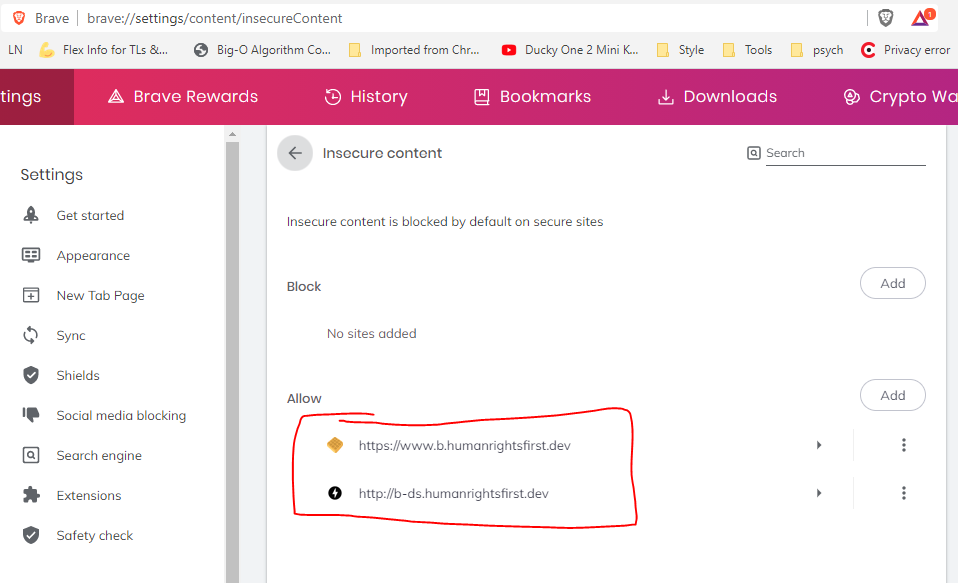

# Human Rights First Police Use of Force Map - Front End

## Description 👇

> **Disclaimer:** This application is currently in Alpha (as of Nov 20, 2020) and is not ready for production. Please use at your own risk as things will change almost daily.

- Our team is developing an interactive map that identifies potential instances of police use of force across the United States of America for [Human Rights First](https://www.humanrightsfirst.org/), an independent advocacy and action organization. We are also developing additional graphics to track and display police use of force trends.
- An application that takes information from data provided by the data science team collecting relevant incidents and data from Twitter, Reddit, and police agencies to display it on the map.
- This app will display various incidents of police use of force on a map that can be filtered by type of force and location with zipcodes and states.

## Deployed App

- https://www.b.humanrightsfirst.dev/\
- Deployed site is currently pulling directly from DS API (Will need to be switched to backend API before production)
  - Will need to configure browser as follows:
    

## Features

- a dynamic navigation bar with tabs displaying either the Map, the Graph, or the About page as well as a popup with the Filter form
- Graph: `(Leftover piece from last group. Not hooked up to current data, still using previous model's classification, names are incorrect. )`
  - timelime view of number of incidents over the course of a year (data dates range)
  - ability to filter out data by type of force used
- Filter `(currently applying just for the map)`:
  - date range implemented `(not functional)`
  - reset filters
  - select state dropdown or search state by typing(selected state can be removed with one click on the x button on the right afterwards): zooms onto the selected state
  - search by zip-code (looked up zipcode can be removed with the x button on the right of it afterwards): zooms onto a zipcode location
  - filter incidents by type of force
  - filter incidents by type of source like Twitter, Reddit, etc `(not functional)`
- Map:
  - Control panel:
    - ability to navigate and zoom on to user's location
    - zoom in/out the map
    - reset bearing to north
  - dynamic Hide/Show Map Options menu:
    - enable/disable zooming on the map with mouse scroll wheel
    - enable/disable fast travel states: turns on a hover option for each screen and zooms onto the highlighted state when clicked
    - reset map view to the original view
  - Naive Categorization: (Check future features for more detail)
    <!-- We're not sure if we want to keep the current ranking system.  -->
    - Categorization occuring on the frontend so users can filter out incidents they want to look at by rank.
    - Currently, each incident can fall under multiple categories of force.

### Environment variable

- Configure environment variables while setting up AWS deploy, not after it is deployed, or there may be some Mapbox token issues.
- `REACT_APP_MAPBOX_TOKEN` Mapbox access tokens (check `https://docs.mapbox.com/help/how-mapbox-works/access-tokens/`)
- `REACT_APP_CLIENT_ID`
- `REACT_APP_OKTA_ISSUER_URI`
- `REACT_APP_API_URI`
  > the environment variables can be found on the previous team's deployment info page or recreated on mapbox studio

## Components

- Loading Page
- NavBar
- Filter Form
- Map
- Graph
- About

## Component Structure

- App

  - NavBar

  - FilterForm (This controls map filtering, and should actually be moved to Map component.)
  - Map (Mapbox is used in this component)

    - TwitterPopup (Incident Views)
    - MapButtons (Controls map functionality)

  - Graph

  - About

## Styling Our App

- `CSS`
- `AntD`

## Data Visualization

`MapBox` - https://docs.mapbox.com :

- using mapboxgl approach

## The Team

- [Hui Zhu](https://github.com/itshui3)  - Team Project Lead

- [Daniel Ajadi](https://github.com/theolamide)  - Team Project Lead

- [Samuel Brown](https://github.com/sambrown0322)  - Front End Engineer

- [Juan Carlos Alvarado-Arguello](https://github.com/CarlosAA10)  - Front End Engineer

- [Charlie Lu](https://github.com/charlupuhh)  - Front End Engineer

- [Jazmine McGinnis](https://github.com/JazmineMT)  - Back End Engineer

- [Robert Sharp](https://github.com/BrokenShell)  - Data Science Engineer

- [Crystal Dixson](https://github.com/cdixson-ds)  - Data Science Engineer

- [Jake Dennis](https://github.com/imdeja)  - Data Science Engineer

## ⚠ Wish List/Future Features:

> Please refer to the highlited parentheses statements throughout this ReadMe for better understanding

- Map:
  - DS sided categorization for filtering in incidents to the map.
    - Naive Categorization occuring in:
      - src/components/common/Map/assets/index.js
      - src/components/common/Map/index.js Lines 67 - 105
    - Incidents associated with one rank only (currently, a rank 5 incident will also appear in rank 4, rank 3, rank 2, rank 1 filters)
  - Other ways to filter incidents:
    - Ability to apply and filter by date range
    - Ability to filter by source type
- Other ways to display data:
  - Graph:
    - User can view trends in data. `(Previous group left a Graph component with dummy data. Not currently hooked up to DS API. Use as reference.)`
  - Calendar:
    - Users can select a date on calendar and view incidents that occured that day. (src/components/common/App.js, Line 53)
